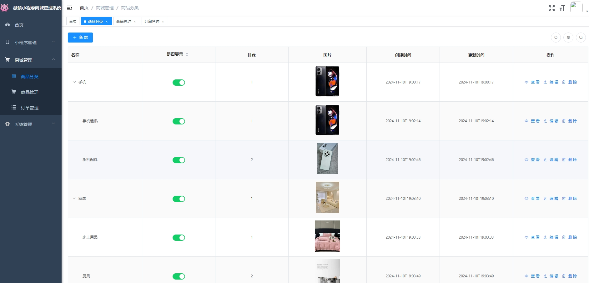
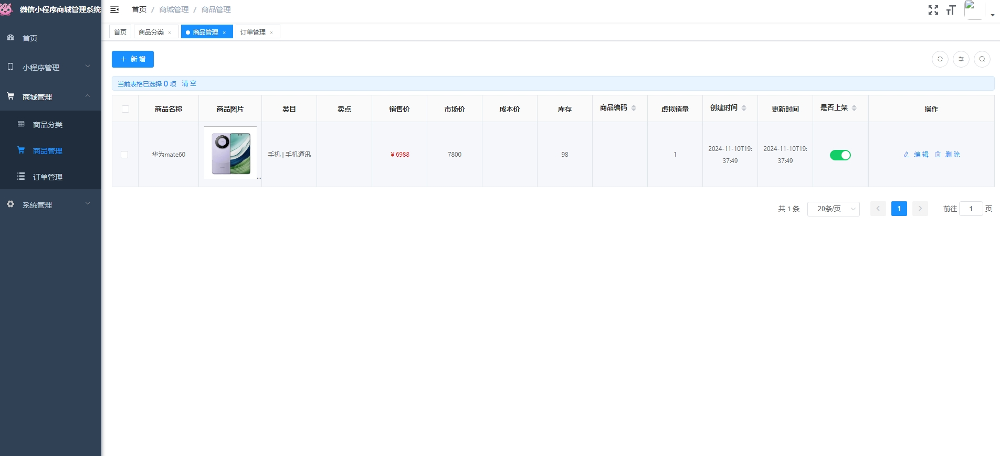
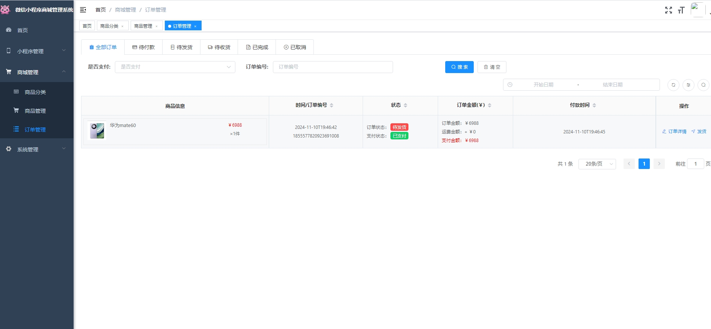
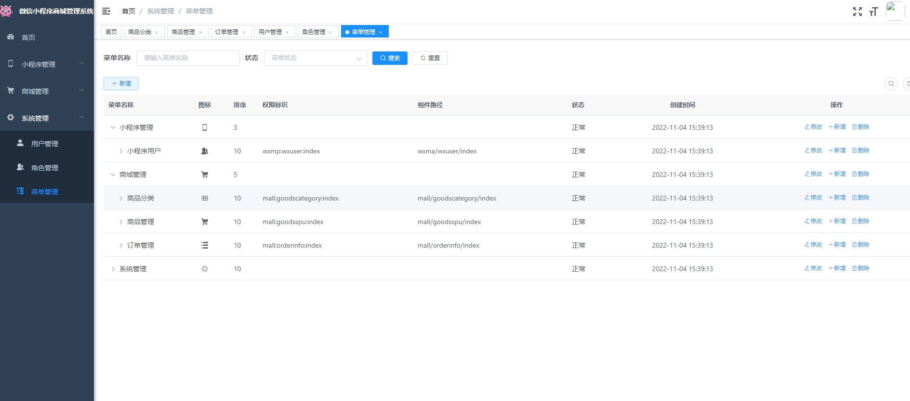
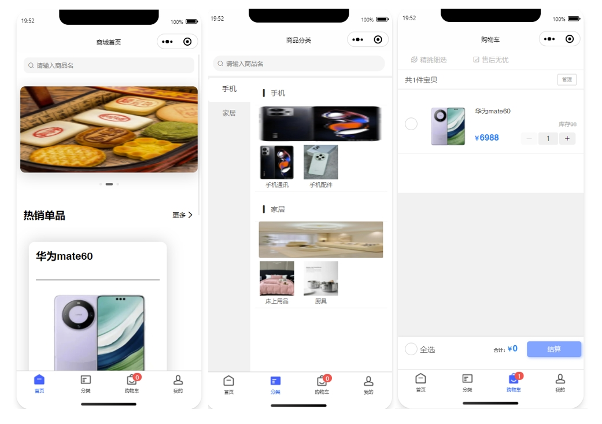
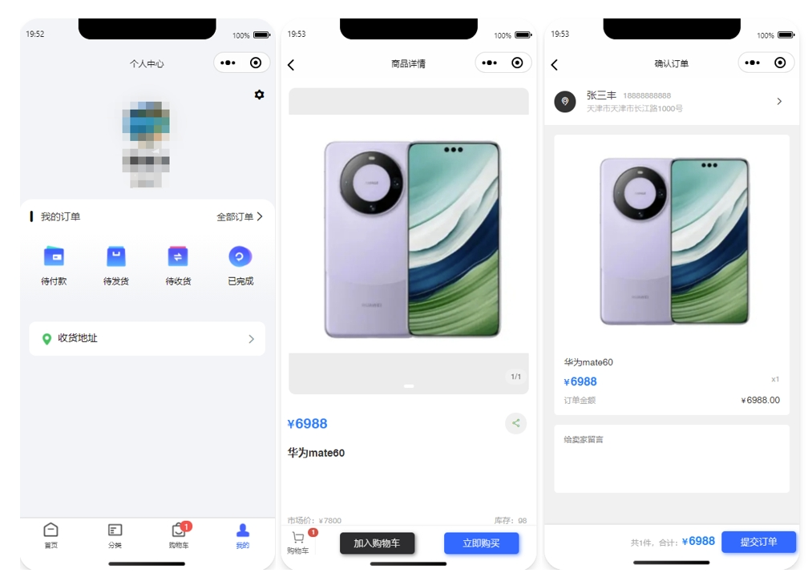
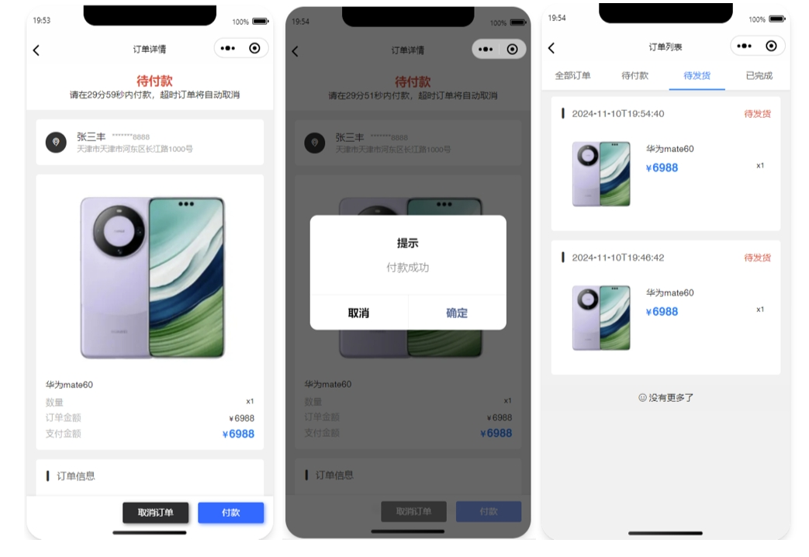
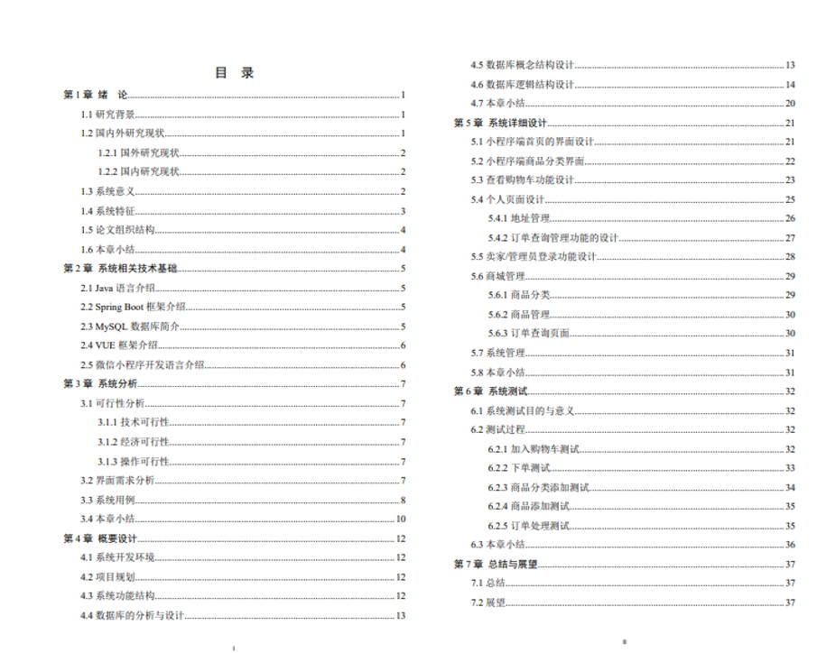

# 1.项目介绍
- 系统角色：管理员、普通用户
- 功能模块：管理员（用户管理、商品分类、商品管理、订单管理、系统管理等），普通用户（个人中心、收藏、我的订单、查看商品等）
- 技术选型：SpringBoot、Vue、原生微信小程序等
- 测试环境：idea2024（安装了vue的插件），myql5.7，jdk1.8，maven3，navicat，node14.16.1等
# 2.项目部署
## 2.1 后端启动
- 创建数据库，导入sql
- 通过idea直接打开压缩包内的project项目，根据本地数据库环境，修改src/main/resources/application-druid.yml 9-11行
- 开启redis，并根据redis环境配置src/main/resources/application.yml  56-62行，一般默认是无密码
- 自行申请微信小程序测试账号，配置src/main/resources/application.yml  126-127行，即appid和secret key
- 关于图片上传目录，在src/main/resources/application.yml 第6行，配置了路径，如果不修改，将压缩包内的sell文件夹，copy到D盘即可。【本电商平台，可以随意的定义为各种类型的购物平台，只需要自己配置商品分类即可，我上传的sql是初始化的，你需要自行根据需求配置分类，这个很简单啦~】
- 启动项目，src/main/java/com/imufe/App.java
## 2.2 管理web
- 说明：可以使用vscode或者webstorm等IDE工具，打开shop-admin目录，因为我的idea安装了vue的插件，所以我直接在idea里运行，步骤如下
- idea中打开终端，输入cd .\shop-admin\
- 因为压缩包内包含了node_modules，所以你可以直接运行，执行 npm run dev指令。注意，我的测试环境是node14.16.1，如果你的是高版本的，可能需要你通过npm install指令安装，如果报错，建议你安装个nvm工具，进行多node版本管理，切换到14.16.1版本
- 管理web的url，可以通过控制台输出获取，账号密码：admin、123456
## 2.3 小程序启动
- 通过微信开发工具，打开shop-wx目录
- 因为在后端部署的时候已经配置了测试号，所以，appid直接选择测试号
- 打开后，首次出现空白的，重新编译一下即可
# 3.项目部分截图

# 4.获取方式
[戳我查看](https://gitee.com/aven999/mall)